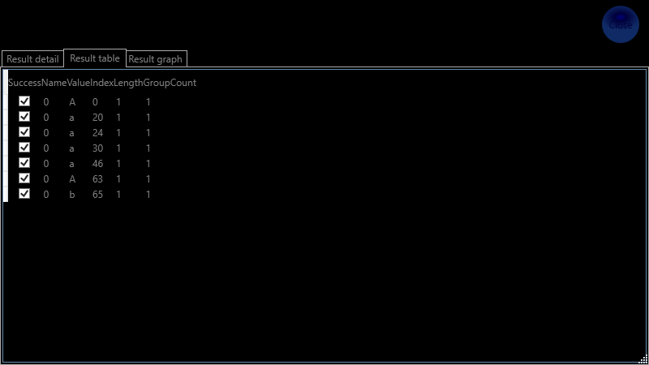
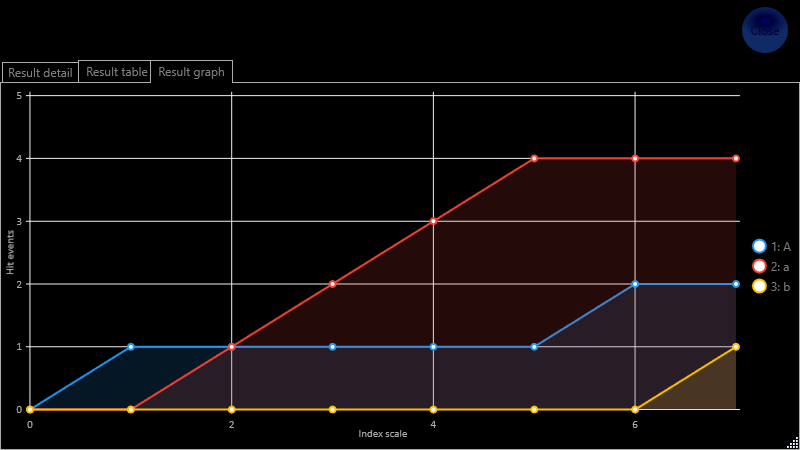

# MiniRegExp

## A program mûködése

A program a MiniRegExp.exe fájl segítségével indítható el és a jobb felsõ sarokban lévõ kék körlap segítségével állítható le.  

A program elsõ indítása alkalmával a következõ kezdõ ablak jelenik meg, kitöltetlen mezõkkel:  

  

A program lehetõséget biztosít:  
- reguláris minta alapú keresésre, lásd: https://docs.microsoft.com/en-us/dotnet/api/system.text.regularexpressions.regex.matches?view=net-6.0  
- és cserére, lásd: https://docs.microsoft.com/en-us/dotnet/api/system.text.regularexpressions.regex.replace?view=net-6.0  
egyaránt.  

### Opciók

- IgnoreCase - kis és nagy betûk megkülönböztetése. További infó itt: https://docs.microsoft.com/en-us/dotnet/api/system.text.regularexpressions.regexoptions?view=net-6.0#System_Text_RegularExpressions_RegexOptions_IgnoreCase  
- Multiline - több soros mód. További infó itt: https://docs.microsoft.com/en-us/dotnet/api/system.text.regularexpressions.regexoptions?view=net-6.0#System_Text_RegularExpressions_RegexOptions_Multiline  
- Singleline - egy soros mód. További infó itt: https://docs.microsoft.com/en-us/dotnet/api/system.text.regularexpressions.regexoptions?view=net-6.0#System_Text_RegularExpressions_RegexOptions_Singleline  

### Keresés

Válasszuk ki a lenyíló listában a Match lehetõséget, töltsük ki a keresési mintát a 'Regular Expression' mezõbe, adjuk meg a bemeneti szöveget, amiben keresni szeretnénk az 'Input Text' mezõbe, majd 
indítsuk el a keresést a 'Start' gomb segítségével. Ennek határsára a 'Result Text' mezõben megjelennek az egyes találatok.  

A keresés megfuttatása után eltûnik a 'Start' gomb és megjelenik egy 'Info panel' gomb:

  

Az 'Info panel' gomb segítségével további információt kérhetünk le a keresésrõl. Az 'Info panel' mindaddig látható marad, amíg a keresési feltételek nem változnak. 
A keresési feltételek változására az 'Info panel' gomb eltûnik és ismét megjelenik a 'Start' gomb.

Az információ panelt a jobb felsõ sarokban lévõ kék körlap gombbal zárhatjuk be. Amíg az információs panel nyitva van, addig a fõ panel inaktív.

#### Eredmény részletezése

A 'Result detail' fülön megnézhetjük az egyes találatokhoz a következõ adatokat:  
- csoport név,  
- találat eredménye, vagyis az a karakterlánc, ami megfelelt a keresési mintának,  
- találat indexe, vagyis az a karakter index, ahonnan a találat karakterlánc kezdõdik az eredeti szövegben és  
- a talált karakterlánc hossza.  

  

#### Eredmény részletezése táblázattal

A 'Result table' fülön ugyanazokat az adatokat lehet megnézni itt is, mint az elõbbi pontban leírtak, csak táblázatba foglalva.

  

#### Eredmény grafikon

A 'Result graph' fülön grafikus formában is megtekinthetõ, hogy melyik indexen mikor milyen találati esemény történt.

 

### Keresés

A lenyíló listában a 'Replace' kiválasztásával használható a csere funkció. A csere hasonló lehetõségeket biztosít, mint a keresés, azzal a 2 különbséggel, hogy a 'Result Text' mezõben
a csere eredménye jelenik meg, valamint megjelenik egy 'Replacement' mezõ, ahova a csere mintáját lehet beírni.
